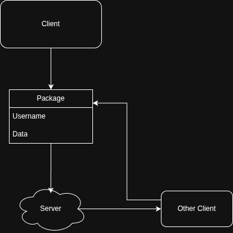

## TODO

- [x] Implement server
  - [x] Accept incoming connections  
  - [x] Manage multiple clients  
  - [x] Add basic message routing  

- [x] Create terminal CLI client (Python)
  - [x] Connect to server  
  - [x] Send/receive messages  
  - [x] Add basic commands (`/quit`, `/help`)

---

